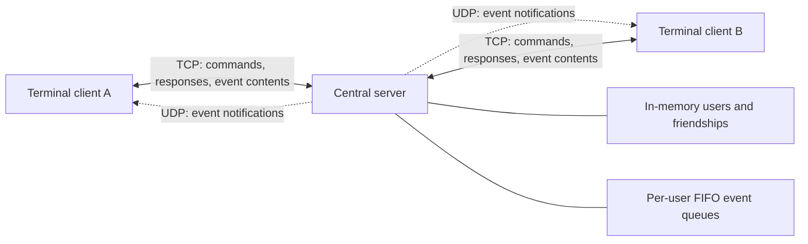

# IPortBook

**A TCP/UDP social messaging service written in C with POSIX sockets.**

IPortBook implements a small social network through a terminal client and a central server. Users can register, reconnect, manage friendships, exchange direct messages, and broadcast messages across their friendship network.

The project explores socket programming, application protocol design, event-driven I/O with `select()`, dynamic event queues, and graph traversal. It was developed by **Filippo Biglieri and Giulio Rengucci**.

## Features

- **Registration and reconnection:** maintain an account across client sessions while the server is running.
- **Friendship requests:** accept or reject requests and receive the corresponding events.
- **Direct messaging:** send messages to friends, including users who are currently offline.
- **Network broadcasts:** reach friends and friends of friends using breadth-first search (BFS).
- **User discovery:** list all registered users, including disconnected users.
- **Asynchronous notifications:** receive a UDP notification when a new event is queued; retrieve its contents over TCP.
- **IPv4 and IPv6:** use numeric addresses, with dual-stack server sockets where supported by the operating system.

## Quick start

### Requirements

- A POSIX environment, such as Linux or macOS. On Windows, use WSL.
- A C compiler available as `gcc`, or another compiler selected through `make CC=...`.
- `make`.

There are no third-party library dependencies.

### Build

```sh
git clone https://github.com/GiulioRengu/ProgettoSETI.git
cd ProgettoSETI
make all
```

This produces `server_exe` and `client_exe`. To select a different compiler:

```sh
make CC=clang all
```

Run `make clean` to remove generated binaries and object files before a fresh build.

### Start the server

```sh
./server_exe 5000 -v
```

### Start two clients in separate terminals

```sh
# Terminal 2: Alice
./client_exe 127.0.0.1 5000 5001 -v
```

```sh
# Terminal 3: Bob
./client_exe 127.0.0.1 5000 5002 -v
```

The general syntax is:

```text
./server_exe <tcp-port> [-v]
./client_exe <server-ip> <server-tcp-port> <client-udp-port> [-v]
```

`-v` enables diagnostic logging. Use `::1` instead of `127.0.0.1` for IPv6 loopback. The client expects a numeric IP address, rather than a hostname. Ports must be in the range **1–9999**. Give each registered user a distinct UDP port; the server checks uniqueness across all registered accounts.

For a demo across machines, replace the loopback address with the server's reachable IP address. The server TCP port and each client's registered UDP port must be reachable over the network.

## Try a complete conversation

Enter the following commands in order. Wait for each server response before entering the next command. Client commands are lowercase; the client builds the corresponding wire messages and adds their terminators automatically.

| Step | Terminal | Command | Expected result |
| --- | --- | --- | --- |
| 1 | Alice | `regis alice001 1234` | `WELCO+++`: Alice is registered. |
| 2 | Bob | `regis bob00001 5678` | `WELCO+++`: Bob is registered. |
| 3 | Alice | `list` | `RLIST 002+++`, followed by two `LINUM` entries. |
| 4 | Alice | `frie bob00001` | `FRIE>+++`: the request is queued for Bob. |
| 5 | Bob | `consu` | `EIRF> alice001+++`: retrieve Alice's friendship request. |
| 6 | Bob | `okirf` | `ACKRF+++`: accept the request. |
| 7 | Alice | `consu` | `FRIEN bob00001+++`: retrieve the acceptance event. |
| 8 | Alice | `mess bob00001 Hello Bob!` | `MESS>+++`: the message is queued for Bob. |
| 9 | Bob | `consu` | `SSEM> alice001 Hello Bob!+++`: retrieve the message. |
| 10 | Alice | `floo Hello everyone!` | `FLOO>+++`: broadcast through the friendship network. |
| 11 | Bob | `consu` | `OOLF> alice001 Hello everyone!+++`: retrieve the broadcast. |
| 12 | Either | `iquit` | `GOBYE+++`: disconnect. |

UDP notifications may appear between these responses. They indicate that events are available; **`consu` retrieves one event at a time**.

To reconnect Alice, restart her client with the same UDP port and enter:

```text
conne alice001 1234
```

The server responds with `HELLO+++`. Reconnection uses the UDP port saved at registration. Accounts, friendships, and queued events survive client disconnections, but are lost when the server stops.

### Client commands

| Command | Purpose |
| --- | --- |
| `regis <id> <password>` | Register a new account and its UDP notification port. |
| `conne <id> <password>` | Reconnect an existing, disconnected account. |
| `frie <id>` | Request a friendship. |
| `okirf` / `nokrf` | Accept or reject the friendship request retrieved with `consu`. |
| `mess <id> <message>` | Queue a direct message for a friend. |
| `floo <message>` | Broadcast to the reachable friendship network. |
| `list` | List registered accounts. |
| `consu` | Retrieve the next queued event. |
| `iquit` | Request disconnection. |
| `help` | Display the local command menu after authentication. |

IDs contain exactly **8 alphanumeric characters**. Passwords are integers from **0 to 65535**. The protocol allows message bodies of at most **200 bytes**; this is a byte limit, so non-ASCII text can use multiple bytes per character. Message bodies must not contain `+++`. Avoid a trailing `+`, which would merge with the wire terminator.

## Architecture



The server runs a single process with a `select()` loop that monitors the listening socket and connected clients. The client similarly monitors standard input, its TCP connection, and its UDP socket.

Each registered user has a FIFO queue implemented as a linked list. A friendship request, friendship decision, direct message, or broadcast becomes an event in that queue. The server sends a UDP notification after enqueueing an event, and `CONSU` retrieves the oldest available event over TCP. Offline users retain queued events in server memory and can consult them after reconnecting.

**Flooding is a server-side graph traversal.** Accepted friendships form an undirected graph. The server performs BFS from the sender, tracks visited users to avoid cycles and duplicates, and queues the message once for each reachable recipient, excluding the sender. Clients do not forward packets to one another. If a recipient's event queue is full, its broadcast event is skipped while traversal continues; `FLOO>` is not a delivery receipt from every recipient.

## The IPortBook application protocol

IPortBook is a custom application protocol carried over TCP and UDP. User messages travel through the server over **TCP**; **UDP carries notifications only**.

### TCP framing and fields

Messages start with a five-character command or response code and end with `+++`. Fields are separated by spaces. TCP is a byte stream, so a single socket read does not necessarily correspond to one application message.

Most fields are textual. Registration and reconnection include one exception: the password is a **two-byte unsigned integer in little-endian order**. For example, password `1234` is transmitted as bytes `D2 04`, not as the ASCII string `"1234"`. These bytes may contain `NUL` or `+`; the receiver excludes the password field from delimiter detection. Use the supplied client to construct these messages.

The table below describes the wire protocol, rather than commands to type into the client. `id` is 8 characters, `pppp` is a four-digit UDP port, `pwd` is the binary password, and `nnn` is a three-digit decimal count.

| Request | Server response |
| --- | --- |
| `REGIS id pppp pwd+++` | `WELCO+++` on success; `GOBYE+++` when registration is rejected. |
| `CONNE id pwd+++` | `HELLO+++` on success; `GOBYE+++` when reconnection is rejected. |
| `FRIE? id+++` | `FRIE>+++` if queued; `FRIE<+++` if rejected. |
| `MESS? id message+++` | `MESS>+++` if queued; `MESS<+++` if rejected. |
| `FLOO? message+++` | `FLOO>+++` after the server processes the broadcast. |
| `LIST?+++` | `RLIST nnn+++`, followed by `nnn` messages of the form `LINUM id+++`. |
| `CONSU+++` | One queued event, or `NOCON+++` if none is available. |
| `OKIRF+++` / `NOKRF+++` | `ACKRF+++` after handling a friendship decision. |
| `IQUIT+++` | `GOBYE+++`, then connection closure. |

Events returned by `CONSU` are:

| Event | Meaning |
| --- | --- |
| `EIRF> id+++` | A friendship request requiring `OKIRF` or `NOKRF`. |
| `FRIEN id+++` | A friendship request was accepted. |
| `NOFRI id+++` | A friendship request was rejected. |
| `SSEM> id message+++` | A direct message from `id`. |
| `OOLF> id message+++` | A broadcast originating from `id`. |

The current server also resends an unanswered friendship request as `EIRF>` after `HELLO` on reconnection.

### UDP notifications

A notification is exactly **three ASCII bytes**, with no `+++` terminator:

```text
XYZ
```

`X` identifies the new event type; `Y` and `Z` are the low and high hexadecimal nibbles of the user's total queued-event count. The **low nibble comes first**.

| `Y` | Event type |
| --- | --- |
| `0` | Friendship request |
| `1` | Friendship accepted |
| `2` | Friendship rejected |
| `3` | Direct message |
| `4` | Broadcast |

For example, a direct-message notification with 18 queued events (`0x12`) is transmitted as `321`. The notification contains no message body. UDP notifications are not acknowledged or retransmitted; queued events remain available through `consu` even if a notification is lost.

## Code map

| Path | Responsibility |
| --- | --- |
| [`client/mainClient.c`](client/mainClient.c) | Client arguments, startup, and signal handling. |
| [`client/client.c`](client/client.c) | Interactive commands and TCP/UDP event handling. |
| [`server/mainServer.c`](server/mainServer.c) | Server arguments, startup, and signal handling. |
| [`server/server.c`](server/server.c) | Connection lifecycle, `select()` loop, and command dispatch. |
| [`server/serverHandlers.c`](server/serverHandlers.c) | Registration, friendships, messaging, and event consultation. |
| [`server/streamHandlers.c`](server/streamHandlers.c) | Per-user FIFO event queues. |
| [`server/floodHandler.c`](server/floodHandler.c) | BFS propagation through the friendship graph. |
| [`server_client/net.c`](server_client/net.c) | Shared socket operations and TCP reception. |
| [`server_client/msgparsing.c`](server_client/msgparsing.c) | Wire-message construction and field extraction. |
| [`server_client/protocol.h`](server_client/protocol.h) | Shared structures, constants, and event types. |

## Scope and current limitations

This is an educational networking implementation with explicit resource limits: **100 registered users** and **255 queued events per user**. All application state is stored in memory. There is no persistent database, transport encryption, or password hashing; the 16-bit password format belongs to the exercise protocol.

The current implementation is intended for controlled demonstrations. Although `select()` multiplexes connections, the TCP frame reader is blocking and malformed-input validation needs further hardening. The client currently displays incoming frames without enforcing one outstanding request or counting all entries in a list response. Run the interactive example sequentially, waiting for each complete response.

The repository currently provides a manual verification flow through the two-client example above; it does not include an automated test target.

TO DO:
implement a wait_server_message to the client.
